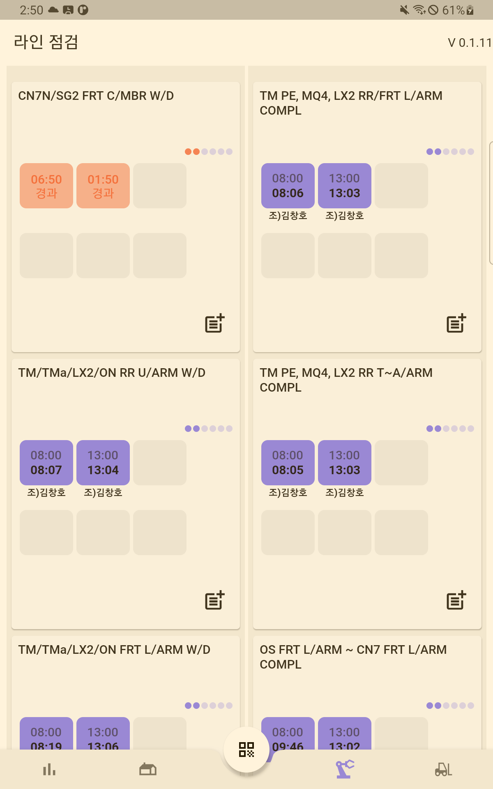
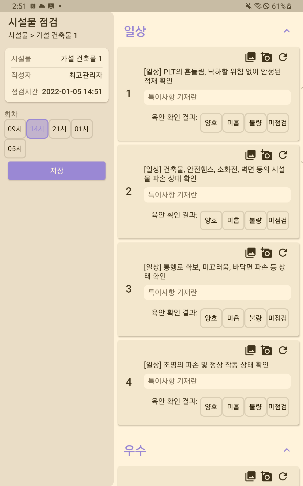

# 화신정공 안전관리 모바일 앱

화신정공 근로자들의 안전을 위하여 사전 정의된 점검 장소(사무실, 공장 등)에서 
필수 안전 점검을 모바일 장치를 통해 점검 사항을 확인, 저장 할 수 있도록 만들어진 애플리케이션

<p align="center">
    
</p>
<p align="center">
    
</p>

## Table of content

- [How it works](#how-it-works)
- [Environment](#environment)
    - [Flutter](#flutter)
        - [Windows](#windows)
        - [Mac/Linux](#mac/linux)
- [Command](#command)
    - [Run](#run)
    - [Test](#test)
    - [Build](#build)
- [Architecture](#architecture)
    - [Project Architecture](#project-architecture)
- [Must Know](#must-know)
    - [Dev Paradigm](#paradigm)
        - [Clean Architecture](#clean-architecture)
    - [Packages](#packages)
        - [Freezed](#freezed)
        - [Json Seriralizable](#json-serializable)
        - [Riverpod](#riverpod)
        - [Dio](#dio)
        - [Dartz](#dartz)
        - [Auto Route](#auto-route)
        - [Flutter Gen](#flutter-gen)
        - [Build Runner](#build-runner)
        - [Mockito](#mockito)

## How it works

- [메뉴얼](https://docs.google.com/presentation/d/1MfrJzRODatcHpw-mQHzU_ZMsHlP33P_7RnMhI-Mp0bU/edit?usp=sharing) 참고


## Environment

### Flutter 

**Note:** 개발된 환경은 flutter 2.2.0-stable

#### Windows

특정한 버전으로 다운로드 받기 위해서 추천하는 tool: [fvm(=Flutter Version Manager)](https://fvm.app/) 

**Note:** Chocolatey가 설치되어있다 가정함. 설치되어 있지 않으면 [Chocolatey](https://chocolatey.org/install) 참고

1. How to install  
```powershell
choco install -y fvm
```

2. Set up certain flutter version
```powershell
fvm install 2.2.0
```

3. Check installation is done
```powershell
fvm list

# Cache Directory:  C:\Users\user\fvm\versions
#
# 2.2.0
```

4. Set installed version
```powershell
# 1. global case
#  - set global flutter version
fvm global 2.2.0

# 2. local case
#  - only under the targeting project directory
fvm use 2.2.0
```


#### Mac/Linux

동일하게 fvm 사용하고 싶다면
```bash
brew install fvm
```

사용은 [Windows](#windows)와 동일함

**Note:** 통합 버전 매니저를 이용하고 싶다면 [asdf](https://github.com/asdf-vm/asdf-plugins) 참고


## Command
### Run

fvm 사용하지 않는 경우
```powershell
flutter run -d web-server --web-renderer canvaskit
```

fvm 사용하는 경우
```powershell
fvm flutter run -d web-server --web-renderer canvaskit
```

### Test

fvm 사용하지 않는 경우
```powershell
flutter test
```

fvm 사용하는 경우
```powershell
fvm flutter test
```

### Build
fvm 사용하지 않는 경우
```powershell
flutter build web --web-renderer canvaskit
```

fvm 사용하는 경우
```powershell
fvm flutter build web --web-renderer canvaskit
```

## Architecture
### Project Architecture

1. Presentation layer
 - 사용자와 interaction을 주고 받게 되는 계층
 - 사용자의 Input을 Application layer로 전달

2. Applcation layer
 - Presentation layer로 부터 받은 Input을 Infrastructure layer로 전달하고 받은 값을 다시 State로 변환하여 사용자에게 전달함

3. Domain layer
 - Domain의 정보를 담고 있는 entity 및 failure 객체를 보관하는 계층
 - Pure Business Logic의 핵심을 담고 있음
 - Flutter 에 관련된 logic은 담고 있으면 안됨
 - POJO(Plain Old Java Object)와 같이 PODO(Plain Old Dart Object) 를 담고 있어야 함

4. Infrastructure layer
 - 데이터를 받아오는 로직을 책임지는 계층
 - repository가 remote, local datasource 와 통신하여 데이터를 가져옴
 - 데이터는 Data Transfer Object로 전환 됨
 - error 가 발생시 Exception을 Domain Layer로 넘기게 됨

Base Architecture에 따라 domain(or feature) 단위로 나누고,  
계층에 따라 1) presentation, 2) application, 3) domain, 4) infrastructure 로 구분함

때에 따라 5) shared 를 따로 만들어, BLoC 및 Dependency Injection을 처리할 수 있는 Provider를 보관한다

```
📦lib
 ┣ 📂auth : 로그인 관련 기능
 ┣ 📂check : 점검 관련 기능
 ┣ 📂core : 전반적으로 사용되는 기능
 ┣ 📂menus 
 ┃ ┣ 📂core : 메뉴 전반에서 사용되는 기능
 ┃ ┣ 📂home : 홈 화면 관련 기능
 ┃ ┣ 📂monitor : 각 화면 현황 기능
 ┃ ┃ ┣ 📂building : 시설물
 ┃ ┃ ┣ 📂core
 ┃ ┃ ┣ 📂forklift : 지게차
 ┃ ┃ ┗ 📂line : 라인
 ┃ ┗ 📂settings : 설정 관련 기능
 ┣ 📂splash : 시작 페이지 관련 기능
 ┣ 📂tag : NFC, QR 코드 관련 기능
 ┃ ┣ 📂core 
 ┃ ┣ 📂nfc : NFC 관련
 ┃ ┗ 📂qr : QR 관련
 ┣ 📂theme : 테마 관련
 ┣ 📂version_check : 버전 확인 관련
 ┗ 📜main.dart
```

## Must Know

### Paradigm

#### Clean Architecture

[web directory의 README 참고](../web/README.md#clean-architecture)
### Packages

#### Freezed
[web directory의 README 참고](../web/README.md#freezed)  

#### Json Seriralizable
[web directory의 README 참고](../web/README.md#json-serializable)  
  
#### Riverpod
[web directory의 README 참고](../web/README.md#riverpod)  

#### Dio
[web directory의 README 참고](../web/README.md#dio)  

#### Dartz
[web directory의 README 참고](../web/README.md#dartz)  

#### Auto Route
[web directory의 README 참고](../web/README.md#auto-route)  

#### Flutter Gen
[web directory의 README 참고](../web/README.md#flutter-gen)  

#### Build Runner
[web directory의 README 참고](../web/README.md#build-runner)  

#### Mockito
[web directory의 README 참고](../web/README.md#mockito)  

#### Rive
[Rive](https://rive.app) 에서 만든 .riv 파일을 추가하여 애니메이션 객체를 조작할 수 있게 해주는 라이브러리  
[pub.dev](https://pub.dev/packages/rive)

