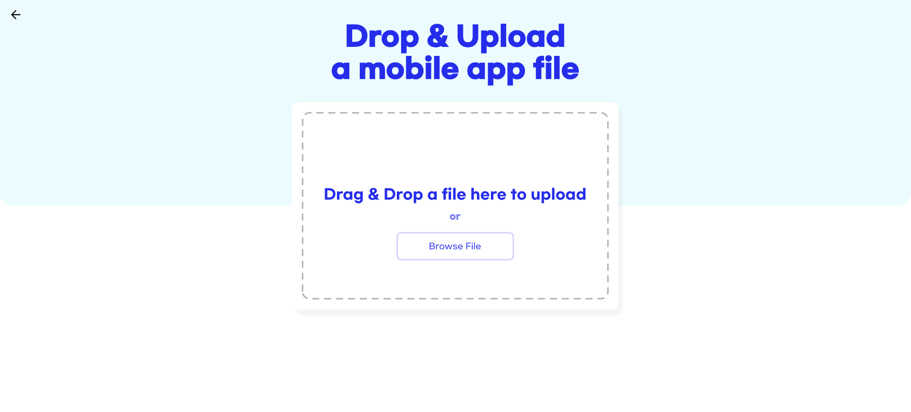
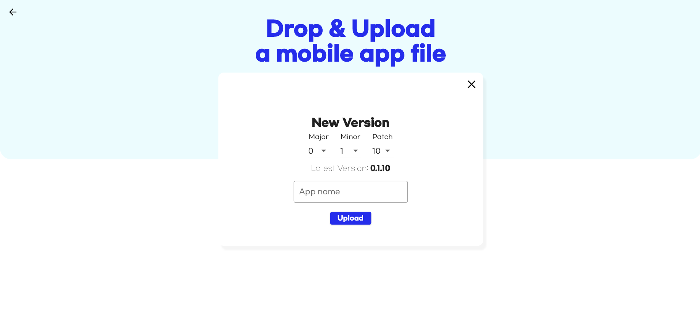
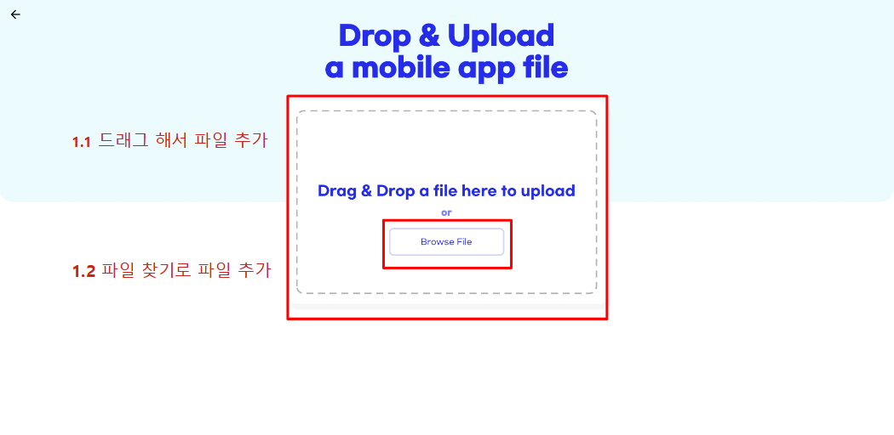
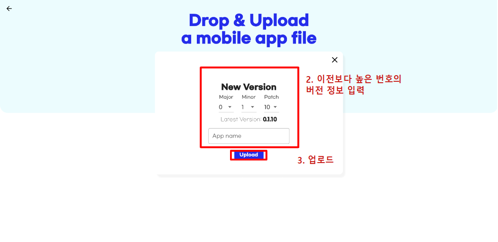
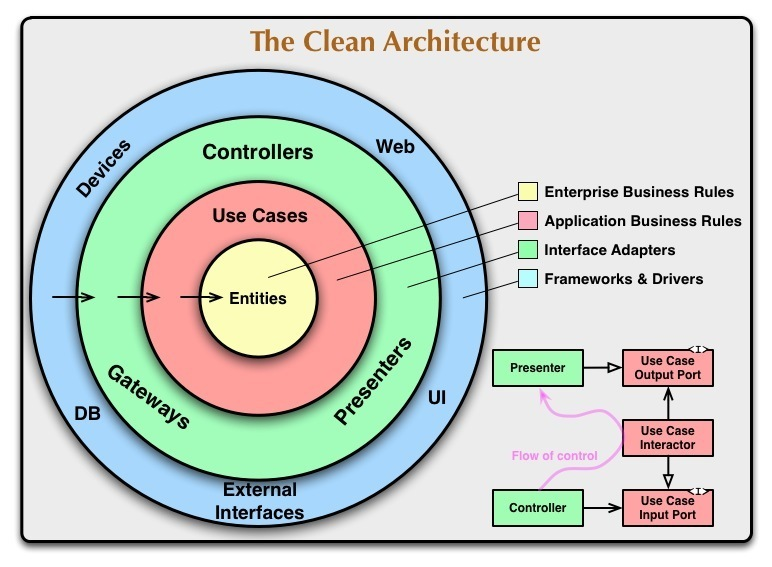
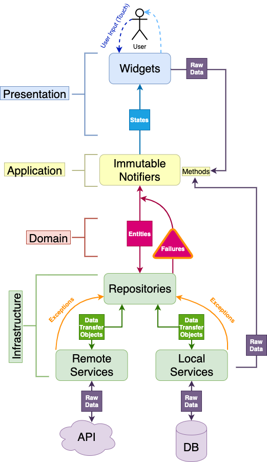
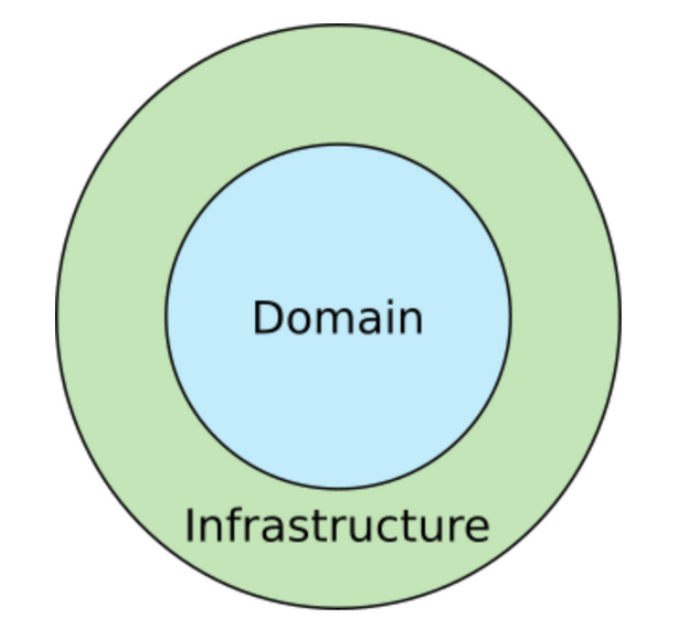

# Hwasin APK Upload Page

[화신 APK 업로드 페이지](http://ss.hitecis.co.kr:9120) 는 [화신 안전 관리 앱](http://ss.hitecis.co.kr:9110) 의 새 배포 버전(.apk) 을 업로드 하는데 사용하는 페이지임.

[]()

[]()

## Table of content

- [How to use](#how-to-use)
- [Dev Setup](#dev-setup)
    - [Flutter](#flutter)
        - [Windows](#windows)
        - [Mac/Linux](#mac/linux)
- [Command](#command)
    - [Run](#run)
    - [Test](#test)
    - [Build](#build)
- [Architecture](#architecture)
    - [Base Architecture](#base-architecture)
    - [Project Architecture](#project-architecture)
- [Must Know](#must-know)
    - [Dev Paradigm](#paradigm)
        - [Clean Architecture](#clean-architecture)
    - [Packages](#packages)
        - [Freezed](#freezed)
        - [Json Seriralizable](#json-serializable)
        - [Riverpod](#riverpod)
        - [Dio](#dio)
        - [Dartz](#dartz)
        - [Auto Route](#auto-route)
        - [Flutter Gen](#flutter-gen)
        - [Build Runner](#build-runner)
        - [Mockito](#mockito)
- [Reference](#reference)

## How to use

- 아래 스크린샷의 프로세스를 참고

[]()
[]()

## Dev Setup

### Flutter 

**Note:** 개발된 환경은 flutter 2.8.1-stable

#### Windows

특정한 버전으로 다운로드 받기 위해서 추천하는 tool: [fvm(=Flutter Version Manager)](https://fvm.app/) 

**Note:** Chocolatey가 설치되어있다 가정함. 설치되어 있지 않으면 [Chocolatey](https://chocolatey.org/install) 참고

1. How to install  
```powershell
choco install -y fvm
```

2. Set up certain flutter version
```powershell
fvm install 2.8.1
```

3. Check installation is done
```powershell
fvm list

# Cache Directory:  C:\Users\user\fvm\versions
#
# 2.8.1
```

4. Set installed version
```powershell
# global
#  - set global flutter version
fvm global 2.8.1

# local
#  - only under the targeting project directory
fvm use 2.8.1
```


#### Mac/Linux

동일하게 fvm 사용하고 싶다면
```bash
brew install fvm
```

사용은 [Windows](#windows)와 동일함

**Note:** 통합 버전 매니저를 이용하고 싶다면 [asdf](https://github.com/asdf-vm/asdf-plugins) 참고


## Command
### Run

fvm 사용하지 않는 경우
```powershell
flutter run -d web-server --web-renderer canvaskit
```

fvm 사용하는 경우
```powershell
fvm flutter run -d web-server --web-renderer canvaskit
```

### Test

fvm 사용하지 않는 경우
```powershell
flutter test
```

fvm 사용하는 경우
```powershell
fvm flutter test
```

### Build
fvm 사용하지 않는 경우
```powershell
flutter build web --web-renderer canvaskit
```

fvm 사용하는 경우
```powershell
fvm flutter build web --web-renderer canvaskit
```

## Architecture

### Base Architecture
Uncle Bob's Clean Architecture 참고  
<p align="center">
    
</p>
해당 개념을 이용한 Architecture

<p align="center">
    
</p>

1. Presentation layer
 - 사용자와 interaction을 주고 받게 되는 계층
 - 사용자의 Input을 Application layer로 전달

2. Applcation layer
 - Presentation layer로 부터 받은 Input을 Infrastructure layer로 전달하고 받은 값을 다시 State로 변환하여 사용자에게 전달함

3. Domain layer
 - Domain의 정보를 담고 있는 entity 및 failure 객체를 보관하는 계층
 - Pure Business Logic의 핵심을 담고 있음
 - Flutter 에 관련된 logic은 담고 있으면 안됨
 - POJO(Plain Old Java Object)와 같이 PODO(Plain Old Dart Object) 를 담고 있어야 함

4. Infrastructure layer
 - 데이터를 받아오는 로직을 책임지는 계층
 - repository가 remote, local datasource 와 통신하여 데이터를 가져옴
 - 데이터는 Data Transfer Object로 전환 됨
 - error 가 발생시 Exception을 Domain Layer로 넘기게 됨

### Project Architecture

Base Architecture에 따라 domain(or feature) 단위로 나누고,  
계층에 따라 1) presentation, 2) application, 3) domain, 4) infrastructure 로 구분함

때에 따라 5) shared 를 따로 만들어, BLoC 및 Dependency Injection을 처리할 수 있는 Provider를 보관한다

```
📦lib
 ┣ 📂core
 ┃ ┣ 📂config            : configuration 관련 로직
 ┃ ┣ 📂constant          : 공통적으로 사용되는 String, Theme, parameter 모음
 ┃ ┣ 📂error             : 에러 상황 모음
 ┃ ┣ 📂extensions        : 확장 기능 모음
 ┃ ┣ 📂gen               : assets 파일을 객체로 사용하기 위해 패키지가 자동 생성한 폴더
 ┃ ┣ 📂network           : 네트워크 연결 관련
 ┃ ┣ 📂routes            : 이동할 수 있는 라우팅 정의 및 가드 설정
 ┃ ┗ 📂widgets           : 공통 사용되는 위젯
 ┃   ┗ 📜app_widget.dart : 프로그램 config 정의
 ┣ 📂features            : feature 별로 domain을 묶어 관리
 ┃ ┣ 📂auth              : 사용자 인증 관련 feature
 ┃ ┃ ┣ 📂application     : application layer. User의 Input을 받아 다른 layer로 전달
 ┃ ┃ ┣ 📂domain          : domain layer
 ┃ ┃ ┃ ┣ 📂entity        : feature 핵심 객체 선언
 ┃ ┃ ┃ ┗ 📂repository    : infrastructure layer에서 사용할 repository interface 제공
 ┃ ┃ ┣ 📂infrastructure  : infrastructure layer
 ┃ ┃ ┃ ┣ 📂datasource    : 원천 데이터 소스로부터 데이터 받아오는 로직 제공
 ┃ ┃ ┃ ┣ 📂model         : datasource로 부터 받은 데이터를 변환하여 가지고 있는 객체 선언
 ┃ ┃ ┃ ┗ 📂repository    : datasource로 받아온 데이터를 다른 layer로 전달
 ┃ ┃ ┣ 📂presentation    : presentation layer. 사용자가 보는 화면 정의
 ┃ ┃ ┃ ┣ 📂screen        : presentation layer 에서 가장 큰 단위의 화면
 ┃ ┃ ┃ ┣ 📂page          : screen 아래 단위의 화면
 ┃ ┃ ┃ ┗ 📂widget        : auth feature에서 사용되는 단위 widget 모음
 ┃ ┃ ┗ 📂shared          : BLoC, Dependency Injection 을 위한 provider 정의
 ┃ ┣ 📂home              : 메인 선택화면 관련 feature. 특별한 로직이 필요 없어 화면만 존재
 ┃ ┃ ┗ 📂presentation    : presentation layer. 사용자가 보는 화면 정의
 ┃ ┃   ┣ 📂page          : presentation layer 에서 가장 큰 단위의 화면
 ┃ ┃   ┣ 📂screen        : screen 아래 단위의 화면
 ┃ ┃   ┗ 📂widget        : home feature에서 사용되는 단위 widget 모음
 ┃ ┗ 📂upload            : 업로드 관련 feature
 ┃   ┣ 📂application     : application layer. 다른 계층으로 명령 전달
 ┃   ┣ 📂domain          : domain layer
 ┃   ┃ ┣ 📂entity        : feature 핵심 객체 선언
 ┃   ┃ ┗ 📂repository    : infrastructure layer에서 사용할 repository interface 제공
 ┃   ┣ 📂infrastructure  : infrastructure layer
 ┃   ┃ ┣ 📂datasource    : datasource로부터 데이터 받아오는 로직 제공
 ┃   ┃ ┃ ┗ 📂remote      : datasource가 remote 일때 사용하는 로직
 ┃   ┃ ┣ 📂model         : DTO 정의
 ┃   ┃ ┗ 📂repository    : datasource로 받아온 데이터를 다른 layer로 전달
 ┃   ┣ 📂presentation    : presentation layer. 사용자가 보는 화면 정의
 ┃   ┃ ┣ 📂page          : presentation layer 에서 가장 큰 단위의 화면
 ┃   ┃ ┣ 📂screen        : screen 아래 단위의 화면
 ┃   ┃ ┗ 📂widget        : upload feature에서 사용되는 단위 widget 모음
 ┃   ┗ 📂shared          : BLoC, Dependency Injection 을 위한 provider 정의
 ┣ 📜main.dart           : entry point
 ┗ 📜provider.dart       : 공통 provider 정의
```

## Must Know

### Paradigm

#### Clean Architecture

계층을 분리하여, 관심사 분리가 핵심  

다음과 같은 이점을 얻을 수 있음
```
1. 프레임워크 독립적
2. 테스트 용이
3. UI 독립적
4. Database 독립적
5. 외부 기능 독립적
```

**Clean Architecture를 간략화한 그림**
<p align="center">
    
</p>

**Domain**  
>Business Rule이 존재하는 영역  

ex. 번역 앱에서 번역 기능, 쇼핑몰에서의 물건, 대출 앱에서 대출 계산 방법  
Business Rule은 잘 변하지 않으므로 안정된 영역(=고수준 영역)

**Infrastructure**  
> Domain에 비해 쉽게 바뀔수 있는 영역  

ex. UI Button의 형태


**의존성 규칙(Dependency Rule)**  
> 모든 소스코드의 의존성은 반드시 outer에서 inner로, 고수준 정책을 향해야 함

Business Logic 을 담당하는 코드들이 DB 또는 Web같이 구체적인 세부사항에 의존하지 않고 독립적으로 실행되야 한다는 규칙  

inner circle에 해당하는 domain은 outer circle인 infrastructure에 대해서는 아무것도 모름  

이러한 의존성 규칙을 지키기 위해서는 **"What data crosses the boundaries"**, **"Crossing boundaries"** 와 같은 상황에 대해서 고려해야 함  

**구체화한 Clean Architecture**

<p align="center">
    
</p>

의존성 규칙에 따라 의존성의 방향은 DB -> Entity, 즉 저수준에서 고수준 정책으로 향하게 되어야 함   

단순화한 다이어그램과 다른 점  
- Domain -> Entity, Usecase로 세분화
- Adapter를 추가하여 Domain과 Infrastructure 사이의 경계를 관리

**Entity**  
핵심 Business Rule 을 담고 있음  
애플리케이션에 종속되지 않고 다양한 애플리케이션에 사용될 수 있음  

**Usecase**  
특정 애플리케이션에 대한 Business Rule  
시스템이 어떻게 자동화 될 것인지 대해서 정의하고 app의 행위를 결정  

**Adapter**  
Domain과 Infrastructure 사이의 번역기 역할을 수행  
GUI의 MVC 아키텍처를 완전히 내포하며, Presenter, View, Controller 모두 여기에 속함    
ex. GUI 로부터 input data를 받아 Usecase와 Entity에 편리한 형태로 repackage. 그리고 entity의 output을 가져와 GUI에 표시하거나 DB에 저장하기 편리한 방식으로 repackage.  

**Infrastructure**  
모든 I/O components (UI, DB, frameworks, devices) 가 있는 곳  
변화될 가능성이 매우 높기 때문에 stable한 domain과는 확실히 분리가 되어있고, 그렇기 때문에 비교적 쉽게 변화되고 component 또한 쉽게 교횐 됨.  


### Packages

#### Freezed
code generation을 이용하여 data class, union class을 자동으로 만들어주는 패키지  
data class를 이용하므로, 같은 값을 가지고 있는 객체 비교가 가능해짐(Dart class는 hashcode가 같지 않을 때 단순 비교하면 다른값으로 취급함)  
union을 사용하여 if 문을 사용하는 것 보다 직관적인 코드를 작성하는 것이 가능함  
[pub.dev](https://pub.dev/packages/freezed)

#### Json Seriralizable
code generation을 이용하여 객체의 Serialization, Deserialization을 만들어주는 패키지  
freezed 패키지와 연동  
[pub.dev](https://pub.dev/packages/json_serializable)
  
#### Riverpod
BLoC을 immutable한 Notifier를 이용하여 구현하는 상태관리 패키지  
[pub.dev](https://pub.dev/packages/riverpod)

#### Dio
http 통신을 단순화한 패키지  
[pub.dev](https://pub.dev/packages/dio)

#### Dartz
Dart 언어를 이용하여 functional programming 기능을 사용할 수 있게 만든 패키지  
[pub.dev](https://pub.dev/packages/dartz)

#### Auto Route
code generation을 이용하여 Flutter Routing을 단순하게 구현할 수 있는 패키지  
[pub.dev](https://pub.dev/packages/auto_route)

#### Flutter Gen
code generation을 이용하여 Assets 파일을 객체로 만들어주는 패키지  
직접 문자열을 작성하다 생기는 에러를 방지할 수 있게 해줌  
[pub.dev](https://pub.dev/packages/flutter_gen)

#### Build Runner
code generation을 하기 위해 사용되는 패키지  
[pub.dev](https://pub.dev/packages/build_runner)

#### Mockito
code generation을 이용하여 Unit Test Mock을 자동으로 생성해주는 패키지  
[pub.dev](https://pub.dev/packages/mockito)

